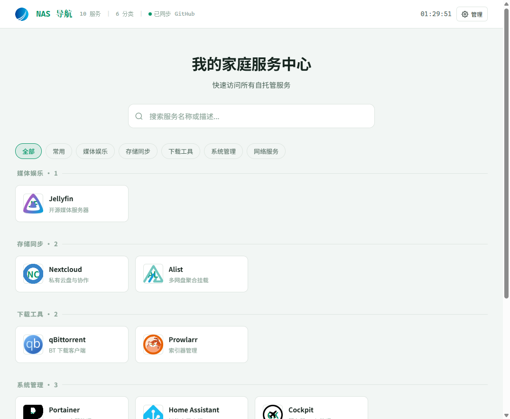
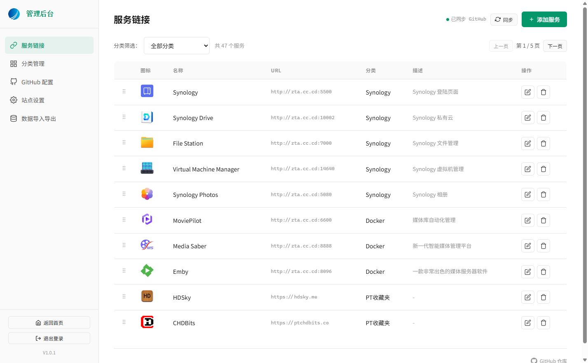
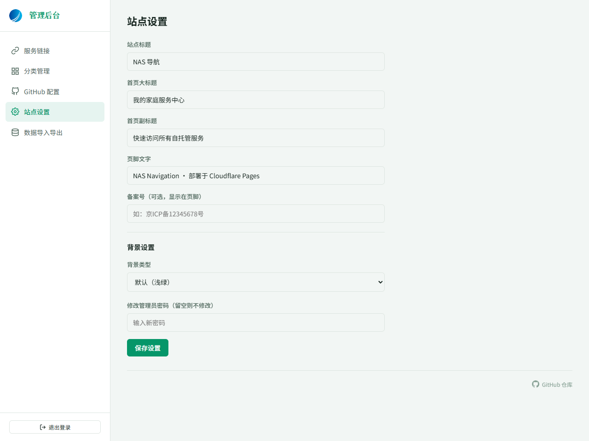

<div align="center">

# 🧭 NAS 导航

**一个简洁优雅的自托管服务导航页，带后台管理，支持多设备自动同步**

**当前版本：V1.0.0**

[]()
[](https://pages.cloudflare.com)
[](https://github.com)
[](LICENSE)

<br>

<div style="display:flex; gap:10px; justify-content:center; flex-wrap:wrap;">
  <a href="https://github.com/xinya585/nas-nav/fork" target="_blank">
    
  </a>
  <a href="https://dash.cloudflare.com/?to=/:account/pages/new/provider/github&repositoryUrl=https://github.com/xinya585/nas-nav" target="_blank">
    
  </a>
</div>

<br>

[🚀 在线预览](https://nav.scy.cc.cd) · [✨ 功能特性](#-功能特性) · [🚀 部署教程](#-部署教程) · [⚙️ 工作原理](#️-工作原理) · [📖 使用说明](#-使用说明) · [❓ 常见问题](#-常见问题)

<br>

> 🌐 **在线体验：[https://nav.scy.cc.cd](https://nav.scy.cc.cd)**
>
> 🔐 **后台入口：`https://你的域名/#/admin`，默认密码 `admin123`**

</div>

---

## 📸 预览

### 前台导航页



### 后台管理 - 服务链接



### 后台管理 - 站点设置（含主题切换、背景自定义、Logo 更换）



---

## ✨ 功能特性

### 🎨 前台展示

| 功能 | 说明 |
|------|------|
| **四套预设主题** | 🌿 浅绿（默认）、💙 浅蓝、⚪ 纯白、🌸 浅粉，后台一键切换，即时预览 |
| **自定义背景** | 支持单色背景、图片背景（URL 或本地上传），透明度 10%-100% 可调 |
| **自定义 Logo** | 后台上传 Logo 图片，自动压缩到 256×256，立即生效，同步更新浏览器 favicon |
| **实时搜索** | 支持按服务名称、描述、URL 快速筛选，输入即过滤 |
| **分类筛选** | 顶部分类标签一键切换，支持「全部」和自定义分类 |
| **图标支持** | 支持图片图标 URL，加载失败自动回退文字缩写图标 |
| **智能卡片** | 有描述时显示名称+描述；无描述时只显示名称并居中放大（17px） |
| **响应式布局** | 桌面端多列自适应（自动换行），移动端完美适配 |
| **秒开无闪烁** | 刷新页面立即显示缓存数据，后台静默从 GitHub 拉取最新数据，告别默认状态闪烁 |
| **实时时钟** | 顶部状态栏显示当前时间，每秒更新 |
| **来访 IP 显示** | 时钟旁显示访客 IP 地址，多接口优先级容错 |
| **备案号** | 可在页脚显示备案号，点击跳转工信部备案查询 |
| **页脚信息** | 显示部署信息、GitHub 仓库链接、当前版本号 |

### 🔐 后台管理

| 功能 | 说明 |
|------|------|
| **密码登录** | 默认密码 `admin123`，可在设置中修改，登录状态持久化到 localStorage |
| **服务 CRUD** | 添加、编辑、删除服务链接，支持图标上传和从库选择 |
| **分类筛选与分页** | 后台服务列表支持按分类筛选，每页 10 条，自动分页，显示总数 |
| **拖拽排序** | 服务和分类支持拖拽调整顺序（六点手柄），松开自动保存并同步 |
| **分类管理** | 自定义服务分类名称与排序 |
| **站点设置** | 自定义标题、首页大标题、首页副标题、页脚文字、备案号、主题、背景、Logo、管理员密码 |
| **数据导入导出** | 一键导出 JSON 备份，支持从 JSON 文件恢复数据（全量覆盖） |
| **图标上传** | 本地上传图标，自动压缩到 128×128，以 base64 内嵌保存 |
| **从库选择图标** | 内置图标库选择器，支持搜索、懒加载预览、高亮选中、确认选择、删除图标 |
| **返回首页** | 后台侧边栏一键返回首页，新标签页打开不影响后台操作 |
| **GitHub 配置** | 可手动配置 Token，或通过 Device Flow 授权自动获取，用于图标上传等高级功能 |
| **版本号显示** | 后台侧边栏底部显示当前版本号，点击跳转 GitHub 仓库 |

### 🚀 部署与运维

| 功能 | 说明 |
|------|------|
| **Cloudflare Pages** | 连接 GitHub 仓库自动部署，全球 CDN 加速，免费额度充足 |
| **多设备自动同步** | 通过 Cloudflare Pages Functions 代理 GitHub API，Token 存在服务端环境变量，**前端无需配置任何 Token**，换设备换浏览器自动同步 |
| **Pages Functions** | 服务端代理 GitHub API，解决 CORS 跨域和 Token 暴露问题 |
| **自动清理部署** | GitHub Actions 每天北京时间 8:00 自动清理 Cloudflare Pages 旧部署，只保留最新 3 个 |
| **自动同步上游** | GitHub Actions 每天北京时间 9:00 自动从上游仓库拉取最新代码，智能跳过你的数据文件 |
| **自定义域名** | 支持绑定自有域名，Cloudflare 自动签发 SSL 证书 |
| **零构建** | 纯静态 HTML + 原生 JS，无需构建工具，无需 Node.js，修改即部署 |

---

## 🚀 部署教程

> 全程约 10-15 分钟，免费即可完成。

### ⚡ 快速部署（推荐）

> ⚠️ **注意**：Cloudflare Pages 只能部署你自己有写权限的仓库（因为后台修改数据需要写入 GitHub）。所以需要**先 Fork 仓库**，再一键部署。

**快速部署 3 步走**：

**第 1 步：Fork 仓库**（10 秒）

点击下方按钮 Fork 到你的 GitHub：

<a href="https://github.com/xinya585/nas-nav/fork" target="_blank">
  
</a>

**第 2 步：一键部署到 Cloudflare**（1 分钟）

Fork 完成后，点击下方按钮跳转到 Cloudflare Pages 创建页面：

<a href="https://dash.cloudflare.com/?to=/:account/pages/new/provider/github&repositoryUrl=https://github.com/xinya585/nas-nav" target="_blank">
  
</a>

- 首次使用需授权 Cloudflare 访问 GitHub
- 在仓库列表中选择**你刚才 Fork 的仓库**（不是上游仓库）
- 构建设置保持默认，点击「Save and Deploy」

**第 3 步：配置环境变量**（2 分钟）

部署完成后，按下方「第四步：配置环境变量」添加 3 个变量，完成！

> 💡 如果你想手动控制每一步（如修改仓库名、分支等），请参考下方的详细步骤。

---

### 前置准备

| 需要 | 说明 | 获取地址 |
|------|------|----------|
| GitHub 账号 | 用于存储代码和数据 | https://github.com |
| Cloudflare 账号 | 用于部署站点和 Functions | https://dash.cloudflare.com/sign-up |
| （可选）自有域名 | 用于绑定自定义访问地址 | 任意域名注册商 |

---

### 第一步：Fork 仓库到你的 GitHub

这一步会把本项目的完整代码复制到你的 GitHub 账号下，你将拥有一份完全独立的副本。

1. 打开本仓库页面：https://github.com/xinya585/nas-nav
2. 点击页面右上角的 **Fork** 按钮
3. 在弹出的页面中：
   - **Repository name**：填写仓库名称，建议 `nas-nav`（或你喜欢的名字）
   - **Description**：可选，填写项目描述
   - **Copy the main branch only**：保持勾选（只复制主分支即可）
4. 点击 **Create fork** 按钮
5. 等待 Fork 完成（通常几秒钟），页面会自动跳转到你自己的仓库

> 💡 **强烈建议使用私有仓库**：Fork 完成后，进入你的仓库 → **Settings** → **General** → 拉到页面最底部的 **Danger Zone** → 点击 **Change repository visibility** → 选择 **Change to private** → 输入仓库名确认。这样你的导航数据（`data.json`，包含服务链接、密码等）不会被公开访问。

---

### 第二步：生成 GitHub Personal Access Token

这个 Token 用于 Cloudflare Pages Functions 读写你仓库中的 `data.json` 数据文件。**Token 非常重要，相当于你的 GitHub 密码，不要泄露给他人。**

1. 访问 GitHub Token 设置页：https://github.com/settings/tokens
2. 点击 **Generate new token** 按钮 → 选择 **Generate new token (classic)**
3. 填写以下信息：
   - **Note**：`nas-nav-sync`（随便填，方便识别这个 Token 的用途）
   - **Expiration**：建议选择 `No expiration`（永不过期，避免后续 Token 过期导致同步失败）
   - **Select scopes**：勾选 `repo`（完整仓库访问权限，会自动勾选所有子项）
4. 滚动到页面底部，点击 **Generate token** 按钮
5. 页面会显示生成的 Token，格式如 `ghp_xxxxxxxxxxxxxxxxxxxx`
6. **立即复制并保存这个 Token**（非常重要！这个 Token 只显示一次，关闭页面后无法再查看，只能重新生成）

> ⚠️ **安全提醒**：Token 只保存在 Cloudflare 服务端环境变量中，不会暴露给前端。但仍请妥善保管，不要分享给他人。

---

### 第三步：在 Cloudflare Pages 创建项目

这一步会把你的 GitHub 仓库连接到 Cloudflare Pages，实现代码推送后自动部署。

1. 登录 Cloudflare Dashboard：https://dash.cloudflare.com
2. 左侧菜单点击 **Workers & Pages**
3. 点击 **Create** 按钮 → 选择 **Pages** 标签页
4. 点击 **Connect to Git** 按钮
5. 首次使用需要授权 Cloudflare 访问你的 GitHub：
   - 点击 **Connect GitHub** 按钮
   - 在 GitHub 授权页面，选择 **All repositories**（推荐，方便后续管理）或只选择你 Fork 的 `nas-nav` 仓库
   - 点击 **Install & Authorize** 按钮
   - 可能需要输入 GitHub 密码确认
6. 授权完成后回到 Cloudflare，在仓库列表中选择你 Fork 的 `nas-nav` 仓库
7. 点击 **Begin setup** 按钮
8. 构建设置（**全部保持默认即可，不要修改**）：
   - **Project name**：项目名称，会作为默认域名（如 `nas-nav.pages.dev`），可自定义
   - **Production branch**：`main`
   - **Framework preset**：`None`
   - **Build command**：留空
   - **Build output directory**：留空
9. 点击 **Save and Deploy** 按钮
10. 等待首次部署完成（约 30 秒到 1 分钟），页面会显示部署进度
11. 部署成功后，点击 **Continue to project** 按钮进入项目管理页面

> ✅ 此时你已经可以通过 `https://项目名.pages.dev` 访问站点了，但数据同步还没配置，继续下一步。

---

### 第四步：配置环境变量（关键步骤，必须完成）

> ⚠️ **这一步是多设备自动同步的核心，必须配置，否则换设备数据不会同步，会显示「本地模式」。**

环境变量保存在 Cloudflare 服务端，Functions 通过环境变量读取 Token 访问 GitHub，前端永远拿不到 Token。

1. 在 Cloudflare Pages 项目页面，点击顶部的 **设置（Settings）** 标签
2. 左侧菜单点击 **环境变量（Environment variables）**
3. 在 **Production** 区域（注意是 Production，不是 Preview），点击 **Add** 按钮逐个添加以下变量：

| 变量名 | 值 | 是否必需 | 说明 |
|--------|-----|----------|------|
| `GITHUB_TOKEN` | 第二步生成的 Token（`ghp_xxxx...`） | ✅ 必需 | 用于读写 GitHub 仓库数据 |
| `GITHUB_OWNER` | 你的 GitHub 用户名 | ✅ 必需 | 如 `xinya585`，就是你 GitHub 个人主页 URL 中的名字 |
| `GITHUB_REPO` | 你的仓库名 | ✅ 必需 | 如 `nas-nav` 或 `nas-nav-private` |
| `GITHUB_BRANCH` | `main` | ⭕ 可选 | 默认 `main`，不填也可以 |
| `GITHUB_PATH` | `data.json` | ⭕ 可选 | 默认 `data.json`，不填也可以 |

4. 每个变量填写后点击 **Add** 按钮确认添加
5. 全部添加完成后，Cloudflare 会**自动触发一次重新部署**（因为环境变量变更需要重新部署才能生效）
6. 等待部署完成（在 **Deployments** 标签可查看状态，通常 30 秒）

> 💡 **如何确认配置正确**：部署完成后，访问 `https://你的域名/api/data`，如果返回 JSON 数据（包含 `ok: true` 和 `data` 字段），说明配置正确。如果返回错误，检查变量名和值是否正确。

---

### 第五步：验证部署和同步

1. 访问你的 Pages 域名（如 `https://nas-nav.pages.dev`）或自定义域名
2. 页面顶部状态栏应该显示绿色的「**已同步 GitHub**」
3. 访问后台：`https://你的域名/#/admin`
4. 输入默认密码 `admin123` 登录
5. 尝试添加一个测试服务，填写名称和 URL，点击保存
6. 刷新页面，数据应该保留（说明同步正常）
7. 换一个浏览器或设备访问同一网址，应该能看到刚才添加的服务（说明多设备同步正常）

> ✅ **同步状态说明**：
> - 🟢「已同步 GitHub」：环境变量配置正确，数据从 GitHub 加载
> - 🟡「同步中...」：正在从 GitHub 拉取数据，稍等即可
> - 🔴「本地模式」：环境变量配置有误，数据只保存在当前浏览器，换设备不同步。请检查第四步的环境变量配置。

---

### 第六步（可选）：绑定自定义域名

如果你有自己的域名，可以绑定到 Cloudflare Pages，使用自定义域名访问站点。

1. 在 Cloudflare Pages 项目页面，点击 **自定义域（Custom domains）** 标签
2. 点击 **Set up a custom domain** 按钮
3. 输入你的域名（如 `nav.example.com`），点击 **Continue**
4. 如果域名已在 Cloudflare 托管：
   - Cloudflare 会自动配置 DNS 记录（CNAME 指向 Pages 项目）
   - 自动签发 SSL 证书
5. 如果域名不在 Cloudflare 托管：
   - 按页面提示，到你的域名注册商处添加 CNAME 记录
   - 主机记录：`nav`（或你设置的子域名）
   - 记录值：`你的项目名.pages.dev`
   - 添加后等待 DNS 生效（几分钟到几小时）
6. 等待 SSL 证书签发（约 1-2 分钟）
7. 证书签发完成后，即可通过自定义域名访问站点

> 💡 推荐使用 Cloudflare 托管域名，DNS 配置和证书签发都是全自动的，体验最好。

---

### 第七步（强烈推荐 ⚠️ 必看）：配置自动清理部署历史

> ## ⚠️⚠️⚠️ 重要提醒 ⚠️⚠️⚠️
>
> **这个功能绝对不能省略！请务必完成配置！**
>
> 本项目的工作原理是：**你在后台修改任何内容（哪怕只是一个标点符号），系统都会自动更新 GitHub 仓库的 `data.json`，而 GitHub 仓库的每次更新都会触发 Cloudflare Pages 的一次全新部署。**
>
> 这意味着：
> - 你每添加一个服务 → 触发一次部署
> - 你每修改一个标题 → 触发一次部署
> - 你每调整一次排序 → 触发一次部署
> - 你每换一个背景图 → 触发一次部署
> - 你每修改一次密码 → 触发一次部署
>
> **一天修改十几次，一个月就是几百次部署记录！** Cloudflare Pages 会保留全部部署历史，不清理的话会堆积成千上万条，既影响 Dashboard 加载速度，也可能触发 Cloudflare 的部署数量限制。
>
> **所以请务必完成以下配置，让系统每天自动清理旧部署，只保留最新 3 个。**

本项目已内置 GitHub Actions 工作流文件（`.github/workflows/cleanup-deployments.yml`），你只需要配置 Cloudflare API Token 和 GitHub Secrets 即可自动运行。

#### 7.1 创建 Cloudflare API Token

这个 Token 用于 GitHub Actions 调用 Cloudflare API 删除旧部署。

1. 访问 Cloudflare API Tokens 页面：https://dash.cloudflare.com/profile/api-tokens
2. 点击 **Create Token** 按钮
3. 在 **Custom token** 区域点击 **Get started** 按钮
4. 填写以下信息：
   - **Token name**：`nas-nav-cleanup`（随便填，方便识别）
   - **Permissions**：
     - 第一列选择 `Account`
     - 第二列选择 `Cloudflare Pages`
     - 第三列选择 `Edit`
   - **Account Resources**：
     - Include → 选择你的 Cloudflare 账户
   - **Client IP Address Filtering**：留空（不限制 IP）
   - **TTL (Time to Live)**：Start Date 留空（立即生效），End Date 留空（永不过期）
5. 点击 **Continue to summary** 按钮
6. 确认信息无误后，点击 **Create Token** 按钮
7. 页面会显示生成的 Token，格式如 `cfut_xxxxxxxxxxxxxxxxxxxx`
8. **立即复制并保存这个 Token**（只显示一次）

#### 7.2 配置 GitHub Secrets

把 Cloudflare 账户信息和 API Token 配置到 GitHub 仓库的 Secrets 中，workflow 运行时会自动读取。

1. 进入你的 GitHub 仓库页面
2. 点击 **Settings** 标签
3. 左侧菜单点击 **Secrets and variables** → **Actions**
4. 点击 **New repository secret** 按钮，逐个添加以下 3 个 Secret：

| Secret 名称 | 值 | 说明 |
|-------------|-----|------|
| `CLOUDFLARE_API_TOKEN` | 7.1 创建的 Cloudflare API Token（`cfut_xxxx...`） | 用于调用 Cloudflare API |
| `CLOUDFLARE_ACCOUNT_ID` | Cloudflare 账户 ID | 在 Pages 项目设置页面的 URL 中可以找到，格式如 `693610d70e8b8f24509be8c2750d8ae1` |
| `CLOUDFLARE_PROJECT_NAME` | Cloudflare Pages 项目名 | 如 `nas-nav`，就是你第三步创建的项目名 |

5. 每个 Secret 填写后点击 **Add secret** 按钮确认

#### 7.3 验证 workflow 运行

1. 进入你的 GitHub 仓库页面
2. 点击 **Actions** 标签
3. 左侧选择 **自动清理 Cloudflare Pages 部署**（或 `cleanup-deployments`）
4. 点击 **Run workflow** 按钮 → 选择 `main` 分支 → 点击 **Run workflow**
5. 等待几秒，刷新页面，会看到一个新的 workflow 运行
6. 点击进入查看运行日志，确认执行成功（显示删除了多少个旧部署）

> ✅ 配置完成后，workflow 会在每天 **北京时间 8:00** 自动执行，只保留最新 3 个部署。你也可以随时在 Actions 页面手动触发。

---

### 第八步（可选）：配置自动同步上游代码

当本项目（上游仓库）发布新版本时，你的 Fork 仓库可以自动同步最新代码，无需手动操作。

> 💡 **工作原理**：每天北京时间 9:00 自动从上游 `xinya585/nas-nav` 拉取最新代码，**智能跳过** `data.json`（你的导航数据）和 `icons/` 目录（你上传的图标），只同步代码文件。

#### 8.1 配置 Workflow 权限

1. 进入你的 GitHub 仓库 → **Settings** → **Actions** → **General**
2. 找到 **Workflow permissions** 区域
3. 选择 **Read and write permissions**
4. 点击 **Save** 按钮保存（这一步必须做，否则 workflow 没有推送代码的权限）

#### 8.2 验证 workflow

1. 进入仓库 **Actions** 页面
2. 左侧选择 **自动同步上游代码**（或 `sync-from-upstream`）
3. 点击 **Run workflow** 手动触发一次
4. 确认执行成功（会显示同步了哪些文件）

> ⚠️ **注意**：自动同步只会更新代码文件（`index.html`、`functions/`、`logo.png`、`README.md`、workflow 文件等），**不会修改你的 `data.json` 导航数据和 `icons/` 图标文件**。如果上游的代码结构发生重大变化（如 `data.json` 格式变更），可能需要手动迁移数据，届时会在 Release 中说明。

---

## ⚙️ 工作原理

### 数据同步流程

```
用户浏览器                    Cloudflare Pages              GitHub 仓库
    │                              │                           │
    │  1. 访问站点                  │                           │
    │ ──────────────────────────>  │                           │
    │                              │  2. Functions 读取 data.json │
    │                              │ ─────────────────────────>  │
    │                              │  3. 返回 JSON 数据          │
    │                              │ <─────────────────────────  │
    │  4. 渲染页面，显示「已同步」   │                           │
    │ <──────────────────────────  │                           │
    │                              │                           │
    │  5. 后台修改数据，点击保存     │                           │
    │ ──────────────────────────>  │                           │
    │                              │  6. Functions 写入 data.json │
    │                              │ ─────────────────────────>  │
    │                              │  7. 返回成功                │
    │                              │ <─────────────────────────  │
    │  8. 显示保存成功              │                           │
    │ <──────────────────────────  │                           │
    │                              │                           │
    │  9. GitHub 仓库更新，自动触发  │                           │
    │     Cloudflare Pages 重新部署 │                           │
    │                              │ <─────────────────────────  │
```

**核心设计要点**：
- 前端不直接调用 GitHub API，而是通过 `/api/data` 端点访问 Cloudflare Pages Functions
- Functions 使用服务端环境变量中的 `GITHUB_TOKEN` 读写 GitHub 的 `data.json`
- Token 永远不会暴露给前端，安全可靠
- 换设备、换浏览器无需任何配置，自动从 GitHub 加载最新数据
- localStorage 缓存上次数据，实现秒开无闪烁

> 💡 **注意**：第 6 步「Functions 写入 data.json」会更新 GitHub 仓库，而 GitHub 仓库的每次更新都会**自动触发 Cloudflare Pages 的一次全新部署**。因此后台的每一次保存操作都会产生一条新的部署记录，**自动清理部署历史的功能必不可少**（详见部署教程第七步）。

### 自动清理部署流程

```
GitHub Actions（每天北京时间 8:00）
    │
    │  1. 调用 Cloudflare API 列出所有部署
    │ ──────────────────────────────────────>  Cloudflare API
    │                                          │
    │  2. 按创建时间排序，保留最新 3 个         │
    │ <──────────────────────────────────────  │
    │                                          │
    │  3. 逐个删除其余旧部署                    │
    │ ──────────────────────────────────────>  Cloudflare API
    │                                          │
    │  4. 完成，输出删除报告                    │
    │ <──────────────────────────────────────  │
```

### 自动同步上游代码流程

```
GitHub Actions（每天北京时间 9:00）
    │
    │  1. 从上游 xinya585/nas-nav 拉取最新代码
    │ ──────────────────────────────────────>  GitHub
    │                                          │
    │  2. 智能对比，跳过 data.json 和 icons/    │
    │                                          │
    │  3. 提交更新到你的仓库 main 分支          │
    │ ──────────────────────────────────────>  GitHub
    │                                          │
    │  4. 触发 Cloudflare Pages 自动部署        │
    │                                          │
    │  5. 完成，你的站点自动更新到最新版本       │
```

### 文件结构说明

```
nas-nav/
├── index.html                  # 主页面（包含所有 CSS 和 JS，单文件应用）
├── data.json                   # 导航数据（后台修改后自动更新，存在 GitHub）
├── logo.png                    # 默认站点 Logo 和 favicon
├── functions/                  # Cloudflare Pages Functions（服务端代码）
│   └── api/
│       ├── data.js             # 数据代理端点（GET 读取 / PUT 写入 /api/data）
│       ├── icons.js            # 图标代理端点（列表 / base64 / 图片直连 / 删除 /api/icons）
│       ├── device-code.js      # GitHub Device Flow 代理（可选，用于后台获取 Token）
│       └── access-token.js     # GitHub Access Token 代理（可选）
├── .github/
│   └── workflows/
│       ├── cleanup-deployments.yml    # 自动清理 Cloudflare Pages 旧部署
│       └── sync-from-upstream.yml     # 自动同步上游代码（可选）
├── icons/                      # 用户上传的图标（自动生成，base64 也内嵌在 data.json 中）
├── screenshots/                # README 预览截图
│   ├── home.png
│   ├── admin.png
│   └── settings.png
└── README.md                   # 项目说明文档（本文件）
```

---

## 📖 使用说明

### 登录后台

1. 访问 `https://你的域名/#/admin`
2. 输入密码登录（默认密码 `admin123`）
3. 登录成功后进入后台管理界面

> 🔐 **首次部署后建议立即修改密码**：进入后台 → 站点设置 → 修改管理员密码 → 保存设置。
>
> ✅ 登录状态会自动保存到 localStorage，刷新页面无需重新登录。
>
> 🚪 点击后台侧边栏底部的「退出登录」可清除登录状态。
>
> 🏠 点击「返回首页」可在新标签页打开前台，不影响后台操作。

### 添加服务

1. 进入后台 → **服务链接** → 点击右上角 **添加服务** 按钮
2. 填写以下信息：
   - **服务名称** *（必填）*：显示在卡片上的名称
   - **URL 地址** *（必填）*：点击卡片跳转的链接（如 `http://nas.local:8096`）
   - **所属分类**：选择服务所属的分类
   - **图标文字**：1-2 个字符，无图片图标时显示（如 `JF`）
   - **图标 URL**：图标图片地址，优先显示。可以：
     - 直接输入图片 URL
     - 点击「上传图片」本地上传（自动压缩到 128×128）
     - 点击「从库选择」从图标库中选择（支持搜索、预览）
   - **图标颜色**：图标文字背景色（默认纯白色 `#FFFFFF`）
   - **描述**：服务说明，显示在名称下方。*留空时前台卡片只显示服务名称并居中放大（17px），不显示网址*
3. 点击 **保存** 按钮
4. 前台即时更新，并自动同步到 GitHub（触发一次 Cloudflare 部署）

### 编辑和删除服务

- **编辑**：在服务列表中点击对应行的 ✏️ 编辑按钮，修改后保存
- **删除**：在服务列表中点击对应行的 🗑️ 删除按钮，确认后删除

### 后台筛选与分页

后台服务链接页面支持：
- **分类筛选**：顶部下拉菜单可按分类筛选服务，默认显示全部分类
- **自动分页**：每页显示 10 个服务，超过时自动显示「上一页 / 下一页」按钮
- **计数显示**：显示当前筛选结果的服务总数和当前页码

### 拖拽排序

在服务链接或分类管理页面：
1. 找到要调整顺序的行
2. 鼠标移到行首的 **六点手柄**（⋮⋮）上
3. 按住左键拖拽到目标位置
4. 松开鼠标，自动保存并同步到 GitHub

### 管理分类

1. 进入后台 → **分类管理**
2. 点击 **添加分类** 按钮，填写分类名称
3. 拖拽调整分类顺序（同服务排序）
4. 编辑或删除分类（删除分类不会删除该分类下的服务，服务会变为未分类）
5. 服务可在编辑时切换所属分类

### 切换主题

1. 进入后台 → **站点设置** → 找到「主题设置」区域
2. 在「预设主题」下拉中选择：
   - 🌿 **浅绿**（默认）：清新自然，护眼舒适
   - 💙 **浅蓝**：清爽科技感
   - ⚪ **纯白**：极简干净
   - 🌸 **浅粉**：温柔女性向
3. 选择后**立即预览**效果
4. 点击页面底部的 **保存设置** 按钮持久化

### 更换站点 Logo

1. 进入后台 → **站点设置** → 找到「站点 Logo」区域
2. 点击 **上传 Logo** 按钮选择本地图片（建议正方形，PNG 格式）
3. 图片自动压缩到 256×256，立即生效
4. 同时更新：页面导航栏 Logo、后台侧边栏 Logo、登录页 Logo、浏览器 favicon
5. 点击 **恢复默认** 可还原为默认 Logo

> 💡 Logo 以 base64 格式保存在 `data.json` 中，换设备自动同步，无需等待重新部署。

### 自定义背景

1. 进入后台 → **站点设置** → 找到「背景设置」区域
2. 选择背景类型：
   - **跟随主题**：使用当前主题的默认背景色
   - **单色背景**：选择任意纯色作为背景
   - **图片背景**：输入图片 URL 或点击「上传图片」本地上传（自动压缩到 1920px 宽）
3. 调节背景透明度（10% - 100%）
4. 点击 **保存设置**

### 从库选择和管理图标

1. 添加/编辑服务时，点击「从库选择」按钮
2. 弹出图标库选择器：
   - **搜索**：顶部搜索框输入关键词实时过滤
   - **预览**：图标图片懒加载，滚动时自动加载
   - **选择**：点击图标高亮选中（绿色边框），底部显示选中预览
   - **确认**：点击「确认选择」按钮应用选中的图标
   - **删除**：鼠标悬停到图标上，右上角出现红色 × 按钮，点击可删除该图标
3. 确认后图标以 base64 内嵌保存到 `data.json`

> 💡 图标库中的图标来自你 GitHub 仓库的 `icons/` 目录，上传图标时会自动添加到库中。

### 数据备份与恢复

在后台 → **数据导入导出** 中：
- **导出 JSON**：点击下载当前数据的完整备份（包含所有服务、分类、设置、密码、Logo、背景等）
- **导入 JSON**：选择之前导出的 JSON 文件，点击导入（会**全量覆盖**当前所有数据，操作前建议先导出备份）

### 多设备同步

配置好环境变量后（部署教程第四步），**无需任何额外设置**：
- 在任意设备、任意浏览器访问站点，数据自动从 GitHub 加载
- 在后台修改内容后，自动同步到 GitHub
- 其他设备刷新页面即可看到最新内容
- 顶部状态栏显示「已同步 GitHub」表示同步正常

> 🔧 如果显示「本地模式」，说明 Cloudflare 环境变量配置有误，请参考部署教程第四步检查。

### 更新代码

当上游仓库发布新版本时，有三种方式更新：

1. **方式一：自动同步（推荐 ⭐）**
   - 按部署教程第八步配置自动同步 workflow
   - 每天北京时间 9:00 自动拉取最新代码
   - 智能跳过你的 `data.json` 和 `icons/` 目录
   - 无需任何手动操作

2. **方式二：手动触发同步**
   - 进入仓库 **Actions** 页面
   - 选择「自动同步上游代码」
   - 点击 **Run workflow** 手动触发

3. **方式三：手动下载替换**
   - 访问上游仓库下载最新的 `index.html` 和 `functions/` 目录
   - 上传到你自己的仓库覆盖对应文件
   - Cloudflare Pages 会自动部署

> ⚠️ 无论哪种方式，更新代码时都不会覆盖你的 `data.json` 导航数据。但建议更新前先导出数据备份。

---

## 🛠️ 技术栈

| 类别 | 技术 | 说明 |
|------|------|------|
| 前端 | 原生 HTML / CSS / JavaScript | 单文件应用，无框架，无构建工具 |
| 数据存储 | GitHub 仓库（data.json）+ localStorage 本地缓存 | GitHub 为权威数据源，localStorage 为缓存 |
| 服务端代理 | Cloudflare Pages Functions | /api/data、/api/icons、/api/device-code、/api/access-token |
| 部署 | Cloudflare Pages | 全球 CDN，自动部署，免费额度 |
| CI/CD | GitHub Actions | 自动清理部署、自动同步上游代码 |
| 图标库 | dashboard-icons（CDN 引用） | 预置 10 个常用服务图标 |
| 字体 | 思源黑体（Noto Sans SC） | 妙搭 CDN 自托管镜像 |

---

## 📝 默认数据

首次部署时预置了 10 个常见自托管服务示例，可在后台自由增删修改：

| 服务 | 分类 | 说明 |
|------|------|------|
| Jellyfin | 媒体娱乐 | 开源媒体服务器 |
| Nextcloud | 存储同步 | 私有云盘与协作 |
| Portainer | 系统管理 | Docker 容器管理 |
| qBittorrent | 下载工具 | BT 下载客户端 |
| Home Assistant | 系统管理 | 智能家居中枢 |
| AdGuard Home | 网络服务 | 网络广告过滤 |
| Alist | 存储同步 | 多网盘聚合挂载 |
| Nginx Proxy Manager | 网络服务 | 反向代理管理 |
| Prowlarr | 下载工具 | 索引器管理 |
| Cockpit | 系统管理 | 服务器 Web 管理 |

---

## ❓ 常见问题

### Q: 换设备后数据不同步，显示「本地模式」？
**A:** 检查 Cloudflare Pages 环境变量 `GITHUB_TOKEN`、`GITHUB_OWNER`、`GITHUB_REPO` 是否配置正确，以及 Token 是否有 `repo` 权限。配置后需要重新部署才生效。可访问 `https://你的域名/api/data` 验证是否返回 JSON 数据。

### Q: 后台修改后显示同步失败？
**A:** 检查 Token 是否过期，或仓库是否存在。可以直接在 GitHub 仓库查看 `data.json` 是否被更新。如果 Token 过期，重新生成后更新到 Cloudflare 环境变量。

### Q: 可以用私有仓库吗？
**A:** 可以。Fork 后在 GitHub 仓库设置中改为 Private，Cloudflare Pages 仍可正常部署和同步。**推荐使用私有仓库**保护你的导航数据（服务链接、密码等）。

### Q: 如何修改默认密码？
**A:** 登录后台 → 站点设置 → 修改管理员密码 → 输入新密码 → 保存设置。密码以哈希形式保存在 `data.json` 中。

### Q: 上传的图标存在哪里？
**A:** 图标以 base64 格式内嵌在 `data.json` 中，同时也会上传到 GitHub 仓库的 `icons/` 目录（供图标库选择器使用）。换设备自动同步，无需额外配置。

### Q: Cloudflare Pages 部署历史太多怎么办？
**A:** 参考部署教程第七步配置 GitHub Actions 自动清理，每天自动保留最新 3 个部署。也可以在 Cloudflare Pages 项目的 **Deployments** 页面手动删除。

### Q: 修改 Logo 后需要重新部署吗？
**A:** 不需要。Logo 以 base64 保存在 `data.json` 中，上传后立即生效，所有设备刷新即可看到。但保存 `data.json` 会触发一次 Cloudflare 部署（这是正常的，自动清理功能会处理旧部署）。

### Q: 为什么每次后台保存都会触发 Cloudflare 部署？
**A:** 因为数据保存在 GitHub 仓库的 `data.json` 中，每次保存都会更新这个文件，而 GitHub 仓库的任何更新都会自动触发 Cloudflare Pages 部署。这是本项目的设计，确保数据和代码一致。**所以自动清理部署历史的功能必不可少**（部署教程第七步）。

### Q: 来访 IP 显示不准确或不显示？
**A:** 系统会按优先级尝试 5 个 IP 查询接口（Cloudflare trace → ip.sb → ipwho.is → ipify → ipapi.co），如果全部失败会显示「未知」。通常是网络问题，刷新页面即可。

### Q: 刷新页面时会短暂显示默认数据吗？
**A:** 不会。系统使用 localStorage 缓存上次的数据，页面加载时立即渲染缓存数据，然后后台静默从 GitHub 拉取最新数据并更新。实现了秒开无闪烁的体验。

### Q: 如何查看当前版本号？
**A:** 前台页脚和后台侧边栏底部都会显示版本号（如 `V1.0.0`），点击可跳转 GitHub 仓库。

---

## 🤝 贡献

欢迎提交 Issue 和 Pull Request！

- 🐛 发现 Bug 请提交 Issue，尽量附上复现步骤和截图
- 💡 有新功能想法也欢迎提交 Issue 讨论
- 🔧 提交 PR 前请确保代码经过测试

---

## 📄 许可证

[MIT License](LICENSE) - 自由使用、修改和分发。

---

<div align="center">

**如果这个项目对你有帮助，别忘了给个 ⭐ Star 支持一下！**

**当前版本：V1.0.0** · [GitHub 仓库](https://github.com/xinya585/nas-nav) · [在线预览](https://nav.scy.cc.cd)

</div>
