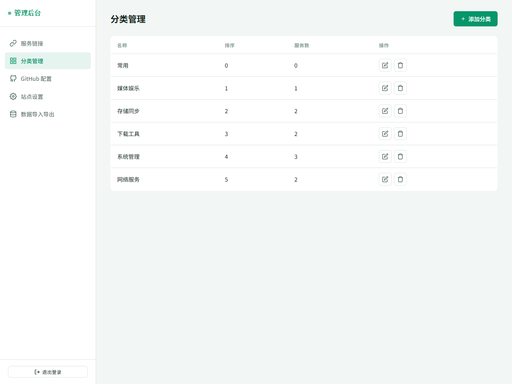

<div align="center">

# 🧭 NAS 导航

**一个简洁优雅的自托管服务导航页，带后台管理，支持 GitHub 多设备同步**

[](https://pages.cloudflare.com)
[](https://github.com)
[](LICENSE)

[在线预览](https://nav.v9.cc.cd) · [功能特性](#-功能特性) · [快速部署](#-快速部署) · [使用说明](#-使用说明)

</div>

---

## 📸 预览

### 前台导航页


### 后台管理 - 服务链接


### 后台管理 - 分类管理



---

## ✨ 功能特性

### 前台展示
- 🎨 **清新浅绿主题** — 明亮舒适的视觉体验
- 🔍 **实时搜索** — 支持按名称、描述、URL 快速筛选
- 🏷️ **分类筛选** — 一键切换服务分类
- 🖼️ **图标支持** — 支持图片图标 URL，加载失败自动回退文字缩写
- 📱 **响应式布局** — 桌面端多列自适应，移动端完美适配
- ⏰ **实时时钟** — 顶部状态栏显示当前时间

### 后台管理
- 🔐 **密码登录** — 默认密码 `admin123`，可在设置中修改
- 📝 **服务 CRUD** — 添加、编辑、删除服务链接
- 📂 **分类管理** — 自定义服务分类与排序
- ⚙️ **站点设置** — 自定义标题、副标题、页脚等
- 💾 **数据导入导出** — 一键备份与恢复
- 🔄 **GitHub 同步** — 配置 Token 后数据自动同步到仓库

### 部署与同步
- 🚀 **Cloudflare Pages** — 连接 GitHub 自动部署，全球 CDN 加速
- 🔗 **自定义域名** — 支持绑定自有域名
- 📦 **零构建** — 纯静态 HTML，无需构建工具
- 🌐 **多设备同步** — 通过 GitHub API 读写 data.json，数据跨设备一致

---

## 🚀 快速部署

### 方式一：GitHub + Cloudflare Pages（推荐）

1. **Fork 本仓库** 到你的 GitHub 账号
2. **登录 [Cloudflare Dashboard](https://dash.cloudflare.com)**
3. 进入 **Workers & Pages** → **Create** → **Pages** → **Connect to Git**
4. 选择你 Fork 的仓库，构建设置保持默认（无需构建命令）
5. 点击 **Save and Deploy**，等待部署完成
6. （可选）在 **Custom domains** 中绑定你的域名

### 方式二：直接上传

1. 下载本仓库的 `index.html` 和 `data.json`
2. 在 Cloudflare Pages 中选择 **Direct Upload**
3. 上传这两个文件即可

---

## 📖 使用说明

### 登录后台

访问 `https://你的域名/#/admin`，输入默认密码 `admin123` 登录。

> 首次部署后建议立即在「站点设置」中修改密码。

### 添加服务

1. 进入后台 → **服务链接** → 点击 **添加服务**
2. 填写服务名称、URL 地址、所属分类
3. （可选）填写图标文字（1-2 字符）或图标 URL
4. 点击保存，前台即时更新

### 管理分类

1. 进入后台 → **分类管理** → 点击 **添加分类**
2. 填写分类名称和排序序号
3. 服务可在编辑时切换所属分类

### GitHub 多设备同步

1. 在 GitHub [生成 Personal Access Token](https://github.com/settings/tokens)（勾选 `repo` 权限）
2. 进入后台 → **GitHub 配置**
3. 填写：
   - **用户名**：你的 GitHub 用户名
   - **仓库名**：`nas-nav`（或你 Fork 后的仓库名）
   - **分支**：`main`
   - **Token**：刚才生成的 Personal Access Token
   - **数据文件路径**：`data.json`
4. 点击 **保存并测试连接**
5. 配置成功后，所有修改会自动同步到 GitHub 仓库的 `data.json`

> 配置 GitHub 同步后，在其他设备上访问站点并填写相同配置，即可自动拉取最新数据。

### 数据备份

在后台 → **数据导入导出** 中：
- 点击 **导出 JSON** 下载当前数据备份
- 选择 JSON 文件可恢复数据

---

## 🛠️ 技术栈

| 类别 | 技术 |
|------|------|
| 前端 | 原生 HTML / CSS / JavaScript（单文件，无框架） |
| 数据存储 | localStorage + GitHub API |
| 部署 | Cloudflare Pages |
| 图标库 | [dashboard-icons](https://github.com/walkxcode/dashboard-icons) |

---

## 📁 项目结构

```
nas-nav/
├── index.html          # 主页面（包含所有 CSS 和 JS）
├── data.json           # 默认导航数据
├── screenshots/        # 预览截图
│   ├── home.png
│   ├── admin.png
│   └── categories.png
└── README.md           # 项目说明
```

---

## 📝 默认数据

预置了 10 个常见自托管服务示例：

| 服务 | 分类 | 说明 |
|------|------|------|
| Jellyfin | 媒体娱乐 | 开源媒体服务器 |
| Nextcloud | 存储同步 | 私有云盘与协作 |
| Portainer | 系统管理 | Docker 容器管理 |
| qBittorrent | 下载工具 | BT 下载客户端 |
| Home Assistant | 系统管理 | 智能家居中枢 |
| AdGuard Home | 网络服务 | 网络广告过滤 |
| Alist | 存储同步 | 多网盘聚合挂载 |
| Nginx Proxy Manager | 网络服务 | 反向代理管理 |
| Prowlarr | 下载工具 | 索引器管理 |
| Cockpit | 系统管理 | 服务器 Web 管理 |

可在后台自由增删修改。

---

## 🤝 贡献

欢迎提交 Issue 和 Pull Request！

---

## 📄 许可证

[MIT License](LICENSE) - 自由使用、修改和分发。

---

<div align="center">

**如果这个项目对你有帮助，别忘了给个 ⭐ Star 支持一下！**

</div>

